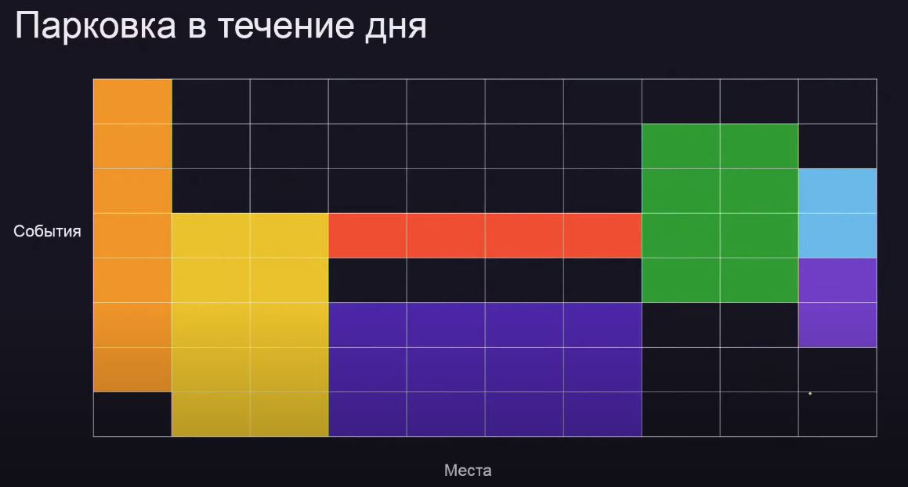

# Конспект Лекции 7: «Сортировка событий»

## Что такое сортировка событий

> Пусть есть некоторые отрезки во времени (например, отрезок когда человек нанодипся не сейте, т.е. известно ею время ввода и вывода)
>
> Что-то интересное происходит только в те моменты, когда человек приводит или уводит - события
>
> Надо что-нибудь посчитать
> 

## Задача 1

> Сайт посетило ```N``` человек, для каждого известно время входа на сайт ```In_i```, и время выхода с сайта ```Out_i```.
> Считается, что человек был на сайте с момента ```In_i```, по ```Out_i```, включительно
>
> Определите, каково **максимальное количество человек** было на сайте одновременно.

### Решение

> Создадим на каждого человека два события: вход и выход.
> Каждое событие — пара, в которой первое число — время, а второе — тип события.
>
> **«Событие «вход на сайт» должно происходить раньше «выхода с сайта»**

```python
def maxvisitorsonline(n, tin, tout):
    events = []
    for i in range(n):
        events.append((tin[i], -1))
        events.append((tout[i], 1))
    events.sort()
    online = 0
    maxonline = 0
    for event in events:
        if event[1] == -1:
            online += 1
        else:
            online -= 1
        maxonline = max(online, maxonline)
    return maxonline
```

## Задача 2

> Сайт посетило ```N``` человек, для каждого известно время входа на сайт ```In_i```, и время выхода с сайта ```Out_i```.
> Считается, что человек был на сайте с момента ```In_i```, по ```Out_i```, включительно
>
> Определите, какое **суммарное время** на сайте был хотя бы один человек.

### Решение

> Если мы пришли в событие с положительным счетчиком количества людей,
> то между этим и предыдущим событием на сайте кто-то был.
> Прибавим к ответу время между текущим и предыдущим событием

```python
def timewithvisitors(n, tin, tout):
    events = []
    for i in range(n):
        events.append((tin[i], -1))
        events.append((tout[i], 1))
    events.sort()
    online = 0
    notemptytime = 0
    for i in range(len(events)):
        if online > 0:
            notemptytime += events[i][0] - events[i - 1][0]
        if events[i][1] == -1:
            online += 1
        else:
            online -= 1
    return notemptytime
```

## Задача 3

> Сайт посетило ```N``` человек, для каждого известно время входа на сайт ```In_i```, и время выхода с сайта ```Out_i```.
> Считается, что человек был на сайте с момента ```In_i```, по ```Out_i```, включительно.
> Начальник заходил на сайт ```M``` раз в моменты времени ```Boss_i``` и смотрел, сколько людей сейчас онлайн.
> Посещения сайта начальником упорядочены по возрастанию времени
>
> Определите, какие **показания счётчика людей онлайн** увидел начальник.

### Решение

> Создадим третий тип события — «вход начальника»
> и при наступлении такого события будем сохранять текущее значение счетчика посетителей

```python
def bosscounters(n, tin, tout, m, tboss):
    events = []
    for i in range(n):
        events.append((tin[i], -1))
        events.append((tout[i], 1))
    for i in range(m):
        events.append((tboss[i], 0))
    events.sort()
    online = 0
    bossans = []
    for i in range(len(events)):
        if events[i][1] == -1:
            online += 1
        elif events[i][1] == 1:
            online -= 1
        else:
            bossans.append(online)
    return bossans
```

## События на круге

> Самый простой пример — **ежедневно** происходящие события
> Круг — это **сутки**
> Идея: разрезать отрезки, проходящие через **полночь**, на два
> 

## Задача 4

> На парковке в торговом центре ```N``` мест (занумерованных от ```1``` до ```N```).
> За день на *Автомойку ул. Герцена, 94 Тюмень За ТЦ "Вояж"* приезжало ```М``` автомобилей,
> при этом некоторые из них длинные и занимали несколько подряд идущих парковочных мест.
> Для каждого автомобиля известно время приезда и отъезда,
> а также два числа — с какого по какое парковочные места он занимал.
> Если в какай-то момент времени один автомобиль уехал с парковочного места,
> то место считается освободившимся и в тот же момент времени на его места может встать другой
>
> Необходимо определить был ли момент времени, в который заняты все парковочные места
> 

### Решение

> События — приезд и отъезд автомобиля (причем отъезд должен происходить раньше).
> Будем поддерживать количество занятых мест и если после очередного события счетчик равен ```N```, то такие моменты были

```python
def isparkingfull(cars, n):
    events = []
    for car in cars:
        timein, timeout, placefrom, placeto = car
        events.append((timein, 1, placeto - placefrom + 1))
        events.append((timeout, -1, placeto - placefrom + 1))
    events.sort()
    occupied = 0
    for i in range(len(events)):
        if events[i][1] == -1:
            occupied -= events[i][2]
        elif events[i][1] == 1:
            occupied += events[i][2]
        if occupied == n:
            return True
    return False
```

## Задача 5

> На парковке в торговом центре ```N``` мест (занумерованных от ```1``` до ```N```).
> За день в ТЦ приезжало ```М``` автомобилей, при этом некоторые из них длинные и занимали несколько подряд идущих парковочных мест.
> Для каждого автомобиля известно время приезда и отъезда,
> а также два числа — с какого по какое парковочные места он занимал.
> Если в какой-то момент времени один автомобиль уехал с парковочного места,
> то место считается освободившимся и в тот же момент времени на его место может встать другой
>
> Необходимо определить, был ли момент, в который были заняты все парковочные места и определить минимальное количество автомобилей,
> которое заняло все места. Если такого момента не было — вернуть ```М + 1```

### Решение

> Добавим еще один счетчик на количество автомобилей и будем обновлять минимальное количество автомобилей когда заняты все места

```python
def mincarsonfullparking(cars, n):
    events = []
    for car in cars:
        timein, timeout, placefrom, placeto = car
        events.append((timein, 1, placeto - placefrom + 1))
        events.append((timeout, -1, placeto - placefrom + 1))
    events.sort()
    occupied = 0
    nowcars = 0
    mincars = len(cars) + 1
    for i in range(len(events)):
        if events[i][1] == -1:
            occupied -= events[i][2]
            nowcars -= 1
        elif events[i][1] == 1:
            occupied += events[i][2]
            nowcars += 1
        if occupied == n:
            mincars = min(mincars, nowcars)
    return mincars
```

## Задача 6

> На парковке в торговом центре ```N``` мест (занумерованных от ```1``` до ```N```). 
> За день в ТЦ приезжало ```М``` автомобилей, при этом некоторые из них длинные и занимали несколько подряд идущих парковочных мест. 
> Для каждого автомобиля известно время приезда и отъезда, а также два числа — с какого по какое парковочные места он занимал. 
> Если в какой-то момент времени один автомобиль уехал с парковочного места,
> то место считается освободившимся и в тот же момент времени на его место может встать другой
>
> Необходимо определить, был ли момент, в который были заняты все парковочные места и определить минимальное количество автомобилей, 
> которое заняло все места, а также номера этих автомобилей (в том порядке, как они перечисляются в списке). 
> Если парковка никогда не была занята полностью вернуть пустой список. 

### Решение (неэффективное)

> Добавим в событие номер автомобиля в списке. При обновлении минимума просто копируем текущее состояние в ответ 

```python
def mincarsonfullparking(cars, n):
    events = []
    for i in range(len(cars)):
        timein, timeout, placefrom, placeto = cars[i]
        events.append((timein, 1, placeto - placefrom + 1, i))
        events.append((timeout, -1, placeto - placefrom + 1, i))
    events.sort()
    occupied = 0
    nowcars = 0
    mincars = len(cars) + 1
    carnums = set()
    bestcarnums = set()
    for i in range(len(events)):
        if events[i][1] == -1:
            occupied -= events[i][2]
            nowcars -= 1
        elif events[i][1] == 1:
            occupied += events[i][2]
            nowcars += 1
            carnums.add(events[i][3])
        if occupied == n and nowcars < mincars:
            bestcarnums = carnums.copy()
            mincars = nowcars
    return bestcarnums
```

### Решение (эффективное)

```python
def mincarsonfullparking(cars, n):
    events = []
    for i in range(len(cars)):
        timein, timeout, placefrom, placeto = cars[i]
        events.append((timein, 1, placeto - placefrom + 1, i))
        events.append((timeout, -1, placeto - placefrom + 1, i))
    events.sort()
    occupied = 0
    nowcars = 0
    mincars = len(cars) + 1
    for i in range(len(events)):
        if events[i][1] == -1:
            occupied -= events[i][2]
            nowcars -= 1
        elif events[i][1] == 1:
            occupied += events[i][2]
            nowcars += 1
        if occupied == n and nowcars < mincars: 
            mincars = nowcars
    carnums = set()
    nowcars = 0
    for i in range(len(events)):
        if events[i][1] == -1:
            occupied -= events[i][2]
            nowcars -= 1
            carnums.remove(events[i][3])
        elif events[i][1] == 1:
            occupied += events[i][2]
            nowcars += 1
            carnums.add(events[i][3])
    if occupied == n and nowcars < mincars:
        return carnums
    return set()
```