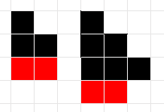

# «Сложность, тестирование, особые случаи» и «Линейный поиск»

## A. Строительство лесенок

Вася занимается строительством лесенок из блоков. Лесенка состоит из ступенек, при этом i-ая ступенька должна состоять ровно из i блоков.

По заданному числу блоков n определите максимальное количество ступенек в лесенке, которую можно построить из этих блоков.

### Формат ввода
Ввводится одно число $n (1 ≤ n ≤ 2^31 - 1)$.

### Формат вывода
Выведите одно число — количество ступенек в лесенке.

**Пример 1**

Ввод
```
5
```
Вывод
```
2
```
**Пример 2**

Ввод
```
8
```
Вывод
```
3
```


### Примечания
Рисунок соответствует примерам. На рисунке черным показаны блоки, использованные при строительстве лестницы, а красным — оставшиеся лишними блоки, которых недостаточно для строительства очередной ступеньки.




```python
def slow(n): 
    nowinrow = 1 
    rows = 0 
    while n >= nowinrow: 
        n -= nowinrow 
        rows += 1 
        nowinrow += 1 
    return rows 

n = int(input())
print(slow(n))
```


## B. Канонический путь
По заданной строке, являющейся абсолютным адресом в Unix-системе, вам необходимо получить канонический адрес.

В Unix-системе "." соответсвутет текущей директории, ".." — родительской директории, при этом будем считать, что любое количество точек подряд, большее двух, соответствует директории с таким названием (состоящем из точек). "/" является разделителем вложенных директорий, причем несколько "/" подряд должны интерпретироваться как один "/".

Канонический путь должен обладать следующими свойствами:

1) всегда начинаться с одного "/"

2) любые две вложенные директории разделяются ровно одним знаком "/"

3) путь не заканчивается "/" (за исключением корневой директории, состоящего только из символа "/")

4) в каноническом пути есть только директории, т.е. нет ни одного вхождения "." или ".." как соответствия текущей или родительской директории

### Формат ввода
Вводится строка с абсолютным адресом, её длина не превосходит 100.

### Формат вывода
Выведите канонический путь.

**Пример 1**

Ввод
```
/home/
```
Вывод
```
/home
```
**Пример 2**

Ввод
```
/../
```
Вывод
```
/
```
**Пример 3**

Ввод
```
/home//foo/
```
Вывод
```
/home/foo
```

### Примечания
В первом примере необходимо убрать "/" в конце строки

Во втором примере нельзя подняться выше корневой директории

В третьем примере несколко подряд идущих "/" должны замениться на один, а также необходимо убрать "/" в конце строки

```python
def simplifyPath(path: str) -> str:
    flag = True
    path += '/' 
    while flag: 
        if '/./' in path: 
            path = path.replace('/./', '/') 
        elif '//' in path: 
            path = path.replace('//', '/') 
        elif '/../' in path:
            pos = path.find('/../') 
            if pos == 0: 
                path = path[3:]
            else: 
                prevslashpos = path.rfind('/', 0, pos - 1) 
                path = path[:prevslashpos] + path[pos + 3:] 
        else: 
            flag = False 
    if path.endswith('/') and path != '/':
        path = path[:-1] 
    return path 

s = input()
print(simplifyPath(s)) 
```


## C. Купить и продать

У вас есть 1000$, которую вы планируете эффективно вложить. Вам даны цены за 1000 кубометров газа за n дней. Можно один раз купить газ на все деньги в день i и продать его в один из последующих дней j, i < j.

Определите номера дней для покупки и продажи газа для получения максимальной прибыли.

### Формат ввода
В первой строке вводится число дней $n (1 ≤ n ≤ 100000)$.

Во второй строке вводится n чисел — цены за 1000 кубометров газа в каждый из дней. Цена — целое число от 1 до 5000. Дни нумеруются с единицы.

## Формат вывода
Выведите два числа i и j — номера дней для покупки и продажи газа. Если прибыль получить невозможно, выведите два нуля.

**Пример 1**

Ввод
```
6
10 3 5 3 11 9
```
Вывод
```
2 5
```
**Пример 2**

Ввод
```
4
5 5 5 5
```
Вывод
```
0 0
```
```python
n = int(input())
cost = list(map(int, input().split()))

bestBuyDay = 0
bestSellDay = 0
minCostDay = 0

for i in range(1, n):
    if cost[bestSellDay] * cost[minCostDay] < cost[bestBuyDay] * cost[i]:
        bestBuyDay = minCostDay
        bestSellDay = i
    if cost[i] < cost[minCostDay]:
        minCostDay = i
        
if bestSellDay == 0 and bestBuyDay == 0: 
    print(0, 0)
else:
    print(bestBuyDay + 1, bestSellDay + 1)
```

## D. Разница во времени
Каждые сутки на вокзал прибывает n электричек. По заданному расписанию прибытия электричек определите минимальное время между прибытием двух разных электричек.

### Формат ввода
В первой строке задано число $n (1 ≤ n ≤ 2 × 10^4)$ — количество электричек.

Во второй строке задано n моментов времени в формате HH:MM (0 ≤ HH ≤ 23, 0 ≤ MM ≤ 59) через пробел.

### Формат вывода
Выведите одно число — минимальное время в минутах между прибытием двух электричек.

**Пример 1**

Ввод
```
2
23:59 00:00
```
Вывод
```
1
```
**Пример 2**

Ввод
```
3
00:00 23:59 00:00
```
Вывод
```
0
```
```python
n = int(input())

timePoints = input().split()
minutePoints = []

for nowTime in timePoints:
    h, m = map(int, nowTime.split(":"))
    minutePoints.append(h * 60 + m)

minutePoints.sort()
minDist = 1440 + minutePoints[0] - minutePoints[-1]

for i in range(1, len(minutePoints)):
    minDist = min(minDist, minutePoints[i] - minutePoints[i - 1])

print(minDist) 
```

## E. Сломай палиндром

Палиндромом называется строка, которая читается одинаково слева-направо и справа-налево.

В заданной строке-палиндроме необходимо заменить один символ, чтобы она перестала быть палиндромом. При этом полученная строка должна быть лексикографически минимальной.

Строка A лексикографически меньше строки B (той же длины), если на первой различающейся позиции в строке A стоит меньший символ, чем в B. Например, строка adbc меньше строки adca, т.к. первые два символа в строках совпадают, а на третьем месте в строке adbc стоит символ b, который меньше символа c, стоящего на третьей позиции в строке adca.

### Формат ввода
Вводится строка-палиндром, состоящая из маленьких букв латинского алфавита. Длина строки не превосходит 1000.

### Формат вывода
Выведите лексикографически минимальную строку, не являющуюяся палиндромом, полученную из исходной строки заменой одного символа.

Если получить такую строку невозможно - выведите пустую строку.

**Пример 1**

Ввод
```
abba
```
Вывод
```
aaba
```
**Пример 2**

Ввод
```
a
```
Вывод
```
```

```python
def sol(s): 
    if len(s) == 1:
        return "" 
    
    middle = len(s) // 2
    flag = False
    
    for i in range(middle):
        if s[i] != "a":
            ans = s[:i] + 'a' + s[i+1:] 
            flag = True
            break
    
    if flag:
        return ans
    else:
        return s[:-1] + 'b'
        
        
s = input() 
print(sol(s)) 
```