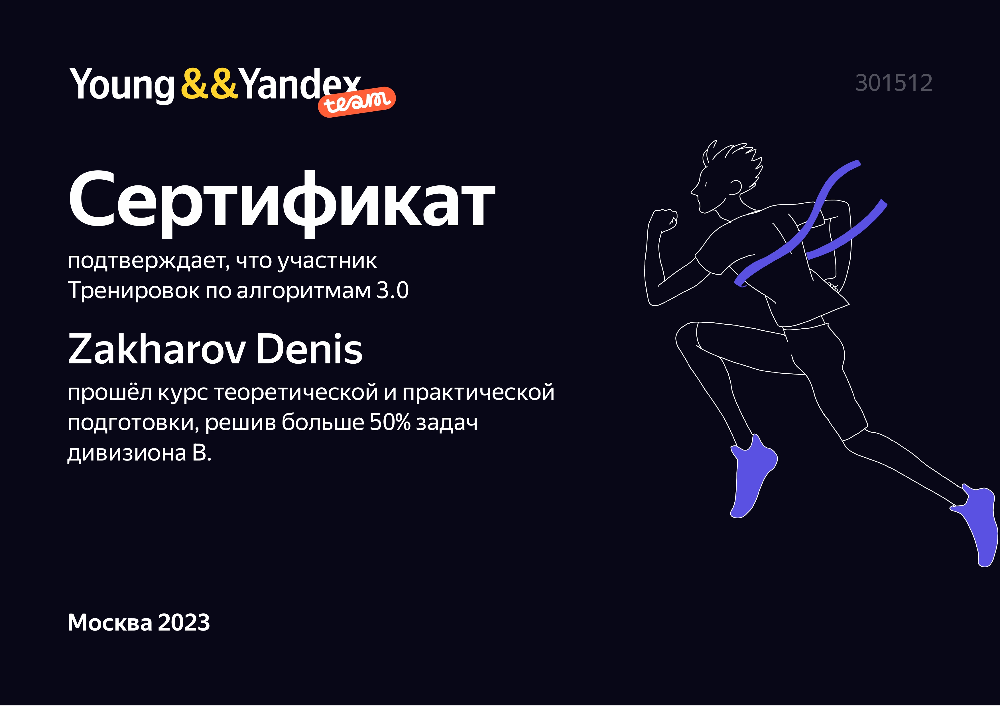
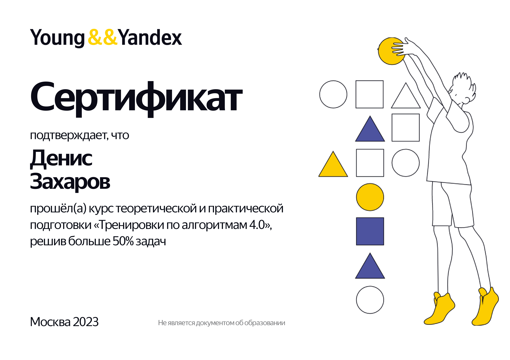

# academy_yandex_Algorithm-Training

 
    

 

⌨️ Solutions to Academy Yandex ["Тренировки по алгоритмам"](https://yandex.ru/yaintern/algorithm-training)

> [!IMPORTANT]
> В этом репозитории я храню исключительно Алгоритмы, возможно вы ищите:
> - [Тренировки по DevOps](https://github.com/MisterZurg/academy_yandex_DevOps-Training)
> - [Тренировки по Machine Learning](https://github.com/MisterZurg/academy_yandex_Machine-Learning-Training)

> [!WARNING]  
> Сейчас, в репе беспорядок, который будет периодически улучшаться, с пополнением решений на
> - Go
> - Rust
> - Zig

> [!CAUTION]
> Одним из побочных эффектов чрезмерного употребления [Python](https://lurkmore.online/Python) является так называемый [Butthurt](https://lurkmore.online/Butthurt).

## About the training
Лекции с [домашними заданиями](https://www.youtube.com/shorts/mpLvLjkWnio) на платформе Яндекс.Контест и ответы на ваши вопросы; занятия с проверкой домашних заданий, разбором решений и популярных ошибок.

### Instructors
[Михаил Густокашин](https://codeforces.com/profile/gustokashin?locale=ru)

Директор центра студенческих олимпиад ФКН ВШЭ, преподаватель алгоритмов и структур данных на ФКН ВШЭ, тренер медалистов ICPC, автор онлайн-курсов (Основы программирования на Python — Coursera, Введение в программирование (C++) — Stepik и др.), заведующий кафедры информатики в ЦПМ, руководитель смен в Сириусе.

### Offered by
[Академия Яндекса](https://academy.yandex.ru/)

## Syllabus
### Тренировки по алгоритмам 1.0
- [Лекция «Сложность, тестирование, особые случаи».](https://www.youtube.com/watch?v=QLhqYNsPIVo)
- [Лекция «Линейный поиск».](https://www.youtube.com/watch?v=SKwB41FrGgU)
- [Лекция «Множества»](https://www.youtube.com/watch?v=PUpmV2ieIHA)
- [Лекция «Словари и сортировка подсчётом»](https://www.youtube.com/watch?v=Nb5mW1yWVSs)
- [Разбор домашнего задания (за 2 и 4 июня)](https://www.youtube.com/watch?v=mdJdB7On4AM)
- [Лекция «Префиксные суммы и два указателя»](https://www.youtube.com/watch?v=de28y8Dcvkg)
- [Лекция «Бинарный поиск»](https://www.youtube.com/watch?v=YENpZexHfuk)
- [Разбор домашнего задания (за 7 и 9 июня)](https://www.youtube.com/watch?v=J2C6rDqe8mQ)
- [Лекция «Сортировка событий»](https://www.youtube.com/watch?v=hGixDBO-p6Q)
- [Лекция «Деревья»](https://www.youtube.com/watch?v=lEJzqHgyels)
- [Разбор домашнего задания (за 15 и 16 июня)](https://www.youtube.com/watch?v=fqsuy5rwZhk)
- [Разбор домашнего задания (за 21 и 23 июня)](https://www.youtube.com/watch?v=5lfkBD4dnGM)
### Тренировки по алгоритмам 2.0
> [!NOTE]
> Новых лекций в этой итерации тренировок не было
#### Дивизион А - Спортивномое программирование
- [Разбор домашнего задания по лекциям 1 и 2, дивизион А](https://www.youtube.com/watch?v=SP_zryTfMIc&t=1s&ab_channel=%D0%90%D0%BA%D0%B0%D0%B4%D0%B5%D0%BC%D0%B8%D1%8F%D0%AF%D0%BD%D0%B4%D0%B5%D0%BA%D1%81%D0%B0)
- [Разбор домашнего задания по лекциям 3 и 4, дивизион A](https://www.youtube.com/watch?v=mjdu8abcNfc&ab_channel=%D0%90%D0%BA%D0%B0%D0%B4%D0%B5%D0%BC%D0%B8%D1%8F%D0%AF%D0%BD%D0%B4%D0%B5%D0%BA%D1%81%D0%B0)
- [Разбор домашнего задания по лекциям 5 и 6, дивизион A](https://www.youtube.com/watch?v=zU12H9x9MNg&ab_channel=%D0%90%D0%BA%D0%B0%D0%B4%D0%B5%D0%BC%D0%B8%D1%8F%D0%AF%D0%BD%D0%B4%D0%B5%D0%BA%D1%81%D0%B0)
- [Разбор домашнего задания по лекциям 7 и 8, дивизион A](https://www.youtube.com/watch?v=4zPoDYvcT6U&ab_channel=%D0%90%D0%BA%D0%B0%D0%B4%D0%B5%D0%BC%D0%B8%D1%8F%D0%AF%D0%BD%D0%B4%D0%B5%D0%BA%D1%81%D0%B0)
#### Дивизион Б - Coding Interview
- [Разбор домашнего задания по лекциям 1 и 2, дивизион B](https://www.youtube.com/watch?v=WZgl1GW3lMA&ab_channel=%D0%90%D0%BA%D0%B0%D0%B4%D0%B5%D0%BC%D0%B8%D1%8F%D0%AF%D0%BD%D0%B4%D0%B5%D0%BA%D1%81%D0%B0)
- [Разбор домашнего задания по лекциям 3 и 4, дивизион B](https://www.youtube.com/watch?v=adZYAsm6kow&t=1s&ab_channel=%D0%90%D0%BA%D0%B0%D0%B4%D0%B5%D0%BC%D0%B8%D1%8F%D0%AF%D0%BD%D0%B4%D0%B5%D0%BA%D1%81%D0%B0)
- [Разбор домашнего задания по лекциям 5 и 6, дивизион B](https://www.youtube.com/watch?v=0ExkSKz0Y8U&ab_channel=%D0%90%D0%BA%D0%B0%D0%B4%D0%B5%D0%BC%D0%B8%D1%8F%D0%AF%D0%BD%D0%B4%D0%B5%D0%BA%D1%81%D0%B0)
- [Разбор домашнего задания по лекциям 7 и 8, дивизион B](https://www.youtube.com/watch?v=r5mRCMLY_L4&ab_channel=%D0%90%D0%BA%D0%B0%D0%B4%D0%B5%D0%BC%D0%B8%D1%8F%D0%AF%D0%BD%D0%B4%D0%B5%D0%BA%D1%81%D0%B0)
### Тренировки по алгоритмам 3.0
- [«Как и зачем изучать алгоритмы»](https://www.youtube.com/watch?v=o3IXpX8wxjQ&ab_channel=%D0%90%D0%BA%D0%B0%D0%B4%D0%B5%D0%BC%D0%B8%D1%8F%D0%AF%D0%BD%D0%B4%D0%B5%D0%BA%D1%81%D0%B0)
- [Лекция 1: «Стеки»](https://www.youtube.com/watch?v=ZUpImO_2hmA&ab_channel=%D0%90%D0%BA%D0%B0%D0%B4%D0%B5%D0%BC%D0%B8%D1%8F%D0%AF%D0%BD%D0%B4%D0%B5%D0%BA%D1%81%D0%B0)
- [Лекция 2: «Очереди, деки и приоритетные очереди»](https://www.youtube.com/watch?v=sAyOhkMZae4&ab_channel=%D0%90%D0%BA%D0%B0%D0%B4%D0%B5%D0%BC%D0%B8%D1%8F%D0%AF%D0%BD%D0%B4%D0%B5%D0%BA%D1%81%D0%B0)
- [Разбор решений](https://www.youtube.com/watch?v=O26-2-94BDk&t=3099s&ab_channel=%D0%90%D0%BA%D0%B0%D0%B4%D0%B5%D0%BC%D0%B8%D1%8F%D0%AF%D0%BD%D0%B4%D0%B5%D0%BA%D1%81%D0%B0)
- [Лекция 3: «Динамическое программирование с одним параметром»](https://youtu.be/H7lu6h8H9-4)
- [Разбор решений](https://youtube.com/live/x2lyWma-Rms?feature=share)
- [Лекция 4: «Динамическое программирование с двумя параметрами»](https://youtube.com/live/U8gzm92fprI?feature=share)
- Обход в глубину
- Разбор решений
- Обход в ширину
- Разбор решений

### Тренировки по алгоритмам 4.0
- [Лекция 1: «Сортировки: быстрая, слиянием и поразрядная»](https://www.youtube.com/watch?v=e3WhTm1G--o)
- Лекция 2: Хеши для строк
- Лекция 3: Кратчайшие пути во взвешенных графах
- Лекция 4: Перебор и методы его оптимизации

### Тренировки по алгоритмам 5.0
* Лекция 1: Сложность, тестирование, особые случаи
* Лекция 2: Линейный поиск
* Лекция 3: Множества и словари
* Лекция 4: Бинарный поиск

#### Accomplishments

 
    

 

 
    

 
