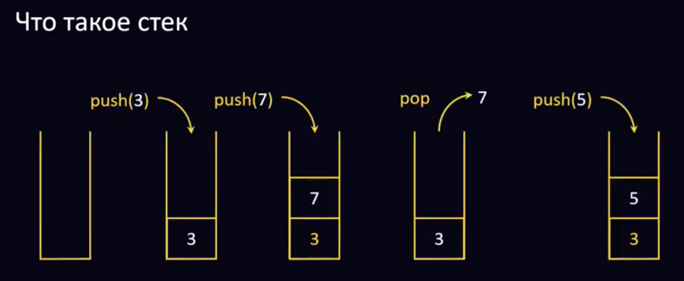
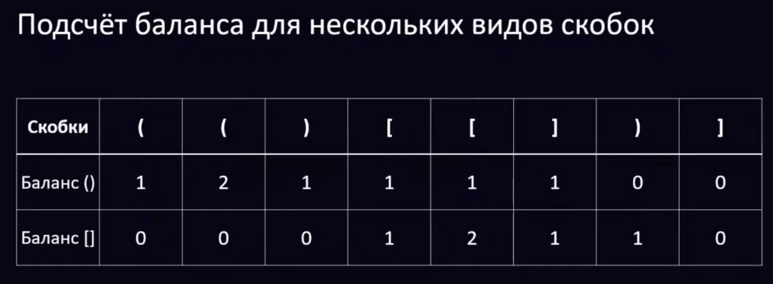
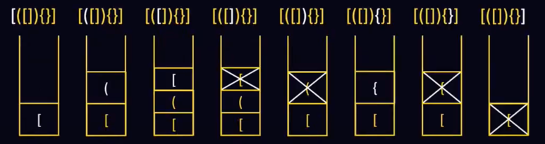
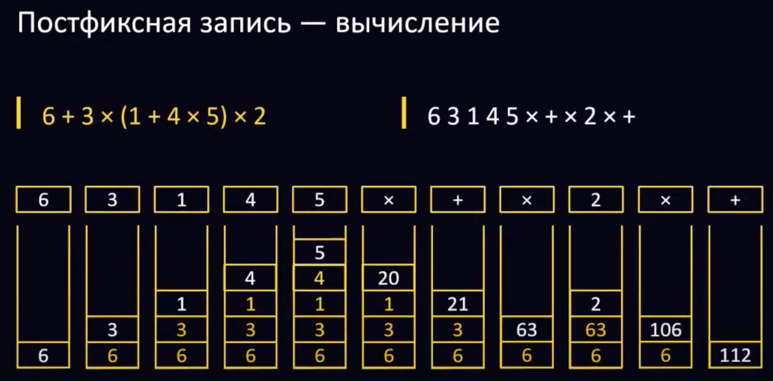
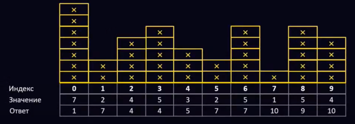

# Конспект Лекция 1: «Стеки»
## Содержание
- Конспект
  - 01 Что такое стек
  - 02 Скобочные последовательности
  - 03 Вычисления выражений
  - 04 Ближайшие  меньшие справа
  - 05 Рекурсия и избавления от неё
- Задачи

## 01 Что такое стек
> Последний пришёл - первый вышел
> 
> Last In - First Out (LIFO)
> 
> `push(x)` - добавить элемент `x`
>
> `pop` - удалить вершину с верхушки
>
## 02 Скобочные последовательности
> Правильная скобочная последовательность
> 
> > *S::= Ø | (S) | S1S2*
> 
> > Правильные: (), (()) ()(()())
> 
> > Неправильные: ((), )(, ())(
>
> Правильная скобочная последовательность с несколькими видами скобок
> 
> > *S::= Ø | (S) | [S] | {S} | S1S2*
> 
> > Правильные: [], {[]()}, []{}()
> 
> > Неправильные: [}, {(}), {[](})
> 
> Подсчёт баланса для одного вида скобок
>> **Общая мысль**: не должны закрываться неоткрытые скобки, в конце все открытые скобки должны быть закрыты
>
>> **Идея**: считаем «баланс» - на каждую открывающую скобку делаем +1, не каждую закрывающую -1. Баланс ПСП всегда не отрицателен и в конце равен нулю
> 
> 

### Идея использования стека
> Открывающие скобки кладём в стек
> Встретили закрывающую - проверили, что стек не пуст, на вершине стека лежит соответствующая открывающая и убрали её
> В конце стек должен оказаться пустым (все открытые закрылись)
> 

### Где используются ПСП
> Например, в html или хт1: открывающий тег открывающая скобка типа «имя тега», а закрывающий тег соответствующая закрывающая скобка

**Неправильно:**
```html
<table><tr></table></tr> 
```
**Правильно:**
```html
<table><tr></tr></table>
```

## 03 Вычисления выражений
### Как мы считаем арифметические выражения
> Ищем самые глубоко вложенные скобки (возможно, с использованием баланса)

> Внутри самых вложенных скобок выполняем операции по убыванию приоритета и заменяем два операнда и операцию на одно число

> Когда внутри скобок осталось одно число - убираем скобки и начинаем сначала

### Инфиксная и постфиксная записи
Инфиксная запись (операция между операндами):
```6 + З × (1 + 4 × 5) × 2```

Постфиксная запись (сначала операнды, потом операция):
```6 3 1 4 5 × + × 2 × +```

### Постфиксная запись 
> Нет скобок

Можно считать за один проход: операнды складываем в стек, а как только встречается операция - берём два верхних операнда из стека, выполняем операцию и кладём результат в стек 
> 

### Преобразование инфиксной записи в постфиксную
- Операнд сразу попадает в ответ
- Операция выталкивает в ответ все операции с больше либо равным приоритетом и кладётся в стек
- Открывающая скобка кладётся в стек
- Закрывающая скобка выталкивает в ответ все операции до открывающем скобки, затем удаляет открывающую скобку
- В конце все операции выписываются в ответ

## 04 Ближайшие меньшие справа

## 05 Рекурсия и избавления от неё
