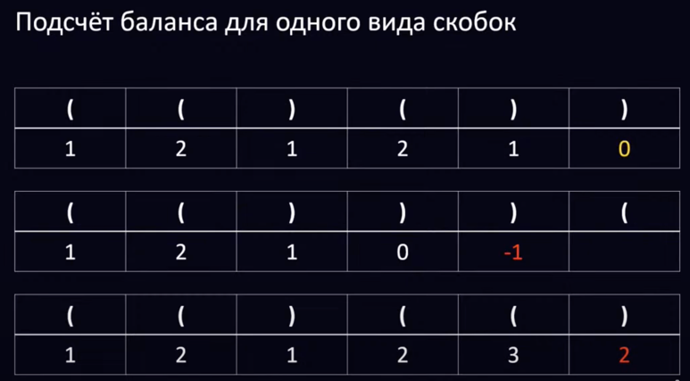

# Конспект Лекция 1: «Стеки»
## Содержание
- Конспект
  - 01 Что такое стек
  - 02 Скобочные последовательности
  - 03 Вычисления выражений
  - 04 Ближайшие  меньшие справа
  - 05 Рекурсия и избавления от неё
- Задачи

## 01 Что такое стек
> Последний пришёл - первый вышел
> 
> Last In - First Out (LIFO)
> 
> `push(x)` - добавить элемент `x`
>
> `pop` - удалить вершину с верхушки
>
## 02 Скобочные последовательности
> Правильная скобочная последовательность
> 
> > *S::= Ø | (S) | S1S2*
> 
> > Правильные: (), (()) ()(()())
> 
> > Неправильные: ((), )(, ())(
>
> Правильная скобочная последовательность с несколькими видами скобок
> 
> > *S::= Ø | (S) | [S] | {S} | S1S2*
> 
> > Правильные: [], {[]()}, []{}()
> 
> > Неправильные: [}, {(}), {[](})
> 
> Подсчёт баланса для одного вида скобок
>> **Общая мысль**: не должны закрываться неоткрытые скобки, в конце все открытые скобки должны быть закрыты
>
>> **Идея**: считаем «баланс» - на каждую открывающую скобку делаем +1, не каждую закрывающую -1. Баланс ПСП всегда не отрицателен и в конце равен нулю
> 
> 

### Идея использования стека
> Открывающие скобки кладём в стек
> Встретили закрывающую - проверили, что стек не пуст, на вершине стека лежит соответствующая открывающая и убрали её
> В конце стек должен оказаться пустым (все открытые закрылись)
> 

### Где используются ПСП
> Например, в html или хт1: открывающий тег открывающая скобка типа «имя тега», а закрывающий тег соответствующая закрывающая скобка

**Неправильно:**
```html
<table><tr></table></tr> 
```
**Правильно:**
```html
<table><tr></tr></table>
```

## 03 Вычисления выражений
### Как мы считаем арифметические выражения
> Ищем самые глубоко вложенные скобки (возможно, с использованием баланса)

> Внутри самых вложенных скобок выполняем операции по убыванию приоритета и заменяем два операнда и операцию на одно число

> Когда внутри скобок осталось одно число - убираем скобки и начинаем сначала

### Инфиксная и постфиксная записи
Инфиксная запись (операция между операндами):
```6 + З × (1 + 4 × 5) × 2```

Постфиксная запись (сначала операнды, потом операция):
```6 3 1 4 5 × + × 2 × +```

### Постфиксная запись 
> Нет скобок

Можно считать за один проход: операнды складываем в стек, а как только встречается операция - берём два верхних операнда из стека, выполняем операцию и кладём результат в стек 
> 

### Преобразование инфиксной записи в постфиксную
- Операнд сразу попадает в ответ
- Операция выталкивает в ответ все операции с больше либо равным приоритетом и кладётся в стек
- Открывающая скобка кладётся в стек
- Закрывающая скобка выталкивает в ответ все операции до открывающем скобки, затем удаляет открывающую скобку
- В конце все операции выписываются в ответ

## 04 Ближайшие меньшие справа


### Поиск ближайшего меньшего справа
> Для каждого числа определить индекс ближайшего меньшего числа, которое находится правее текущего
>
> Очевидное решение за О(N^2) с помощью сбалансированных двоичных деревьев поиска можно решить за О(N logN)
>
> Хотим решение за О(N)

### Идея решения за О(N)
> Будем хранить в стеке пары из значения и индекса элементов, для которых ответ ещё не найден
>
> Пойдём по последовательности слева-направо
>
> Очередной элемент выталкивает из стека все элементы с большим значением - для них он является ответом. После этого ложится в стек сам
>
> Таким образом, стек всегда будет хранить возрастающую последовательность

## 05 Рекурсия и избавления от неё

### Как запускаются функции
> При каждом запуске функции в стеке выделяется память под локальные переменные и параметры. Там же запоминается откуда продолжить выполнение программы после окончания работы функции
>
> Когда функция заканчивается - её переменные и параметры удаляются из стека, а выполнение продолжается с запомненного места 

### Пример работы рекурсивной функции
```py
def factorial(n):
    if n == 1:
        return 1
    prevfac = factorial(n - 1)
    return n * prevfac
```

### Общие правила замены рекурсии стеком
> Это нужно делать только если у языка есть ограничения или нужна неасимтотическая оптимизация
> 
> Делаем цикл «пока стек не пуст» и делаем всю работу руками 

```py
stack = []
stack.append({'n' : 4, 'prevfac' : '?', 'labelfrom' : 0})
while len(stack) > 0:
    localvars = stack[-1]
    labelfrom = localvars['labelfrom']
    if labelfrom <= 0:
        if localvars['n'] == 1:
            returnedvalue = 1
            stack.pop()
            continue
        localvarsrlabelfroml = 1
        stack.append({'n' : localvaral - 1, 'prevfac' : '?', 'labelfrom' : 0})
        continue
    if labelfrom <= 1: 
        localvars['prevfac'] = returnedvalue
        returnedvalue = localvars[n] * localvars['prevfac']
        stack.pop()
        continue
         
         
print(returnedvalue)
```